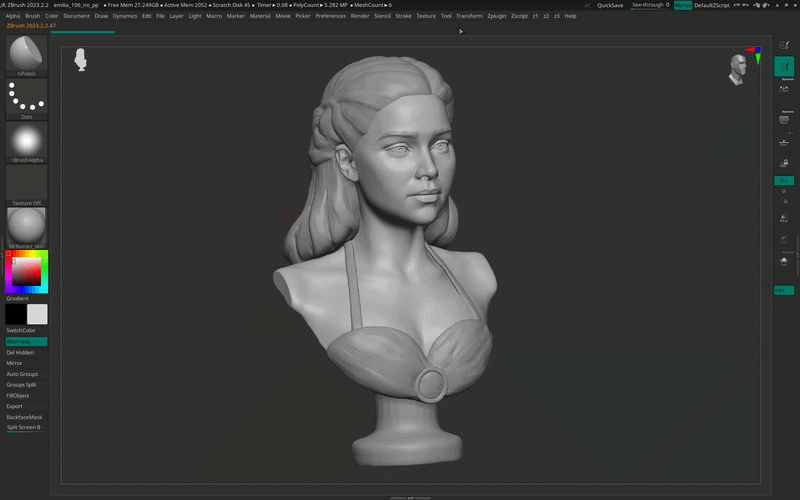
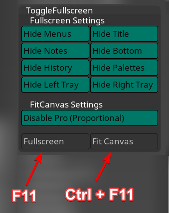

# ToggleFullscreen ZBrush Plugin

A ZBrush plugin that toggles a clean fullscreen view by hiding UI elements,
and fits the canvas to window size.



---

## Features

- **Fullscreen toggle** - hide/show selected UI elements with one hotkey
- **Fit Canvas** - resize canvas to fit current window
- Configurable - choose which elements to hide
- Settings are saved between sessions

---

## Installation

### Option A: Plugin (recommended)

0. Download the latest release from the [Releases](../../releases) page
1. Copy `ToggleFullscreen.zsc` and `ToggleFullscreenData/` folder to:
```
ZBrush/ZStartup/ZPlugs64/
```
2. Restart ZBrush
3. Plugin appears in **ZPlugin → ToggleFullscreen**

### Option B: Load as script

1. In ZBrush open **ZScript → Load**
2. Select `ToggleFullscreen.txt`
3. Plugin appears in **ZPlugin → ToggleFullscreen**

> **Note:** After loading the `.txt` file, ZBrush will automatically create a `ToggleFullscreen.zsc` file next to it. You can then copy this `.zsc` file to `ZBrush/ZStartup/ZPlugs64/` for permanent installation (same as Option A).

> **Important:** The `ToggleFullscreenData/` folder must exist next to the script file for settings saving to work. Without it, your fullscreen preferences will not be saved between sessions.

## File Structure
```
ZStartup/ZPlugs64/
├── ToggleFullscreen.zsc
└── ToggleFullscreenData/
      └── FullscreenSettings.zvr (auto-created on first settings change)
```

---

## Usage

### Fullscreen

Press `F11` to toggle fullscreen view.  
All selected UI elements will be hidden/restored.

### Fit Canvas

Press `Ctrl+F11` to fit canvas to current window size.

---

## Hotkeys

| Hotkey | Action |
|--------|--------|
| `F11` | Toggle Fullscreen |
| `Ctrl+F11` | Fit Canvas to Window |

---


## Fullscreen Settings

**ZPlugin → ToggleFullscreen → Fullscreen Settings**

Configure what gets hidden when entering fullscreen:

| Option | Description |
|--------|-------------|
| Hide Menus | Top menu bar |
| Hide Title | ZBrush title bar |
| Hide Notes | Top-left notes area |
| Hide Bottom | Bottom tray edge |
| Hide History | Undo History selector |
| Hide Palettes | Floating palettes (same as Tab) |
| Hide Left Tray | Collapse left tray |
| Hide Right Tray | Collapse right tray |

---

## Fit Canvas Settings

**ZPlugin → ToggleFullscreen → FitCanvas Settings**

| Option | Description |
|--------|-------------|
| Disable Pro (Proportional) | Disables proportional constraint when resizing canvas |

---
## License

MIT
